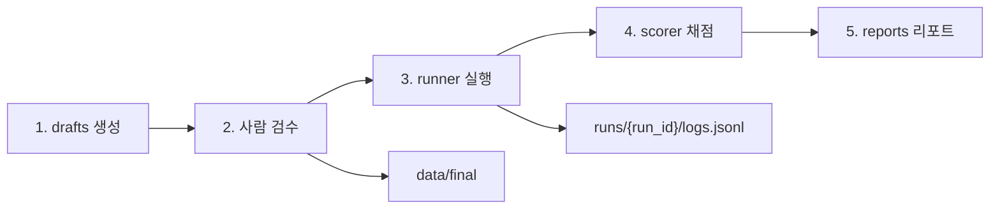

# vehicle-agent-eval

로컬 SLM(Ollama) 기반 **차량 제어 tool-calling agent** 평가 하니스.

모든 추론은 `http://localhost:11434` Ollama 엔드포인트로만 수행한다.  
Gold label은 `data/final/`에 사람이 확정·관리하며, 코드가 수정하지 않는다.

## 디렉터리 구조

```
vehicle-agent-eval/
├── configs/            # 실험 설정 (exp_e1.yaml …)
├── schemas/            # tool JSON, vehicle_state.py
├── data/
│   ├── drafts/         # LLM 생성 초안 (검수 전)
│   ├── final/          # 사람 확정 라벨 (코드 수정 금지)
│   └── synonyms.yaml   # 채점용 정규화 사전
├── src/
│   ├── registry.py     # 툴 로드/검증/변형
│   ├── agent.py        # 프롬프트 + Ollama 호출
│   ├── parser.py       # 출력 → 구조화
│   ├── gate.py         # tier2 × vehicle_state 게이트
│   ├── scorer.py       # normalizer + rule scorer
│   ├── judge.py        # clarify 품질 LLM judge (한정 사용)
│   ├── runner.py       # 실험 실행 루프
│   └── run_log.py      # runs/{run_id} 생성 + JSONL 로깅
├── runs/               # 실험 산출물 (run_id별 logs.jsonl)
├── reports/            # 집계 리포트
└── tests/
```

## 실행 순서

평가 파이프라인은 아래 순서로 진행한다. **현재는 스캐폴드만 존재**하며, 각 단계의 비즈니스 로직은 이후 구현한다.

| 단계 | 담당 | 산출물 | 설명 |
|------|------|--------|------|
| 1. 데이터 생성 | (외부/수동) | `data/drafts/*.jsonl` | LLM 등으로 초안 발화·라벨 생성 |
| 2. 검수 | 사람 | `data/final/*.jsonl` | draft 검수 후 gold label 확정 (코드 비개입) |
| 3. 실행 | `src/runner.py` | `runs/{run_id}/logs.jsonl` | config 기반 반복 실험, 모든 호출 입·출·latency·파싱 결과 기록 |
| 4. 채점 | `src/scorer.py` | (중간 결과) | synonyms 정규화 + 규칙 채점, **T1–T6 유형별** 지표 산출 |
| 5. 리포트 | `reports/` | CSV/표 등 | pandas 집계 후 유형별 리포트 작성 |



## 설정

`configs/exp_e1.yaml` 템플릿:

- `experiment.seed`, `experiment.repeats` — 재현성 (repeats=3)
- `model` — Ollama 모델명·엔드포인트
- `registry` — base(`core`|`tier2`|`distractor`), `remove_enums`, `add_distractors`
- `output` — `runs/` 하위 run_id·logs 경로

## 설치

```bash
python -m venv .venv
.venv\Scripts\activate        # Windows
pip install -e ".[dev]"
```

## 로깅 (구현됨)

```python
from src.run_log import RunLogger, generate_run_id

run_id = generate_run_id("e1")
logger = RunLogger(run_id)
logger.log({
    "utterance_id": "u001",
    "model_input": "...",
    "model_output": "...",
    "latency_ms": 842.1,
    "parse_result": {"success": True},
})
# → runs/{run_id}/logs.jsonl
```

## 테스트

```bash
pytest
```

## E1 베이스라인 결과

`configs/exp_e1.yaml` · `qwen2.5:3b` · seed=42 · repeats=3 · gate=off  
Run: `e1_20260709_150330` (inference 276, parse_fail 12) · 채점: **normalized**

| type | n | tool_sel | arg_acc | executable | false_exec | false_refusal | consistency |
|------|---|----------|---------|------------|------------|---------------|-------------|
| T1 | 75 | 0.833 | 0.222 | 0.560 | — | 0.000 | 0.800 |
| T2 | 57 | 0.947 | 0.368 | 0.667 | — | 0.000 | 0.895 |
| T3 | 30 | 0.300 | 0.100 | 0.700 | 0.700 | — | 0.800 |
| T4 | 45 | 0.667 | 0.667 | 0.756 | 0.333 | — | 0.800 |
| T5 | 30 | 0.750 | 0.750 | 0.800 | 1.000 | 0.167 | 0.900 |
| T5-safe | 15 | 0.750 | 0.750 | 0.800 | — | 0.167 | 0.800 |
| T5-danger | 15 | 0.750 | 0.750 | 0.800 | 1.000 | — | 1.000 |
| T6 | 39 | 0.444 | 0.194 | 0.615 | — | 0.444 | 0.692 |
| ALL(ref) | 276 | 0.708 | 0.360 | 0.663 | 0.552 | 0.102 | 0.815 |

분모는 `summary.md`의 `(hits/applicable)` 표기를 따른다. `—`는 해당 유형에 분모 없음(N/A).  
상세 리포트: `python scripts/score_run.py --run runs/e1_20260709_150330`
